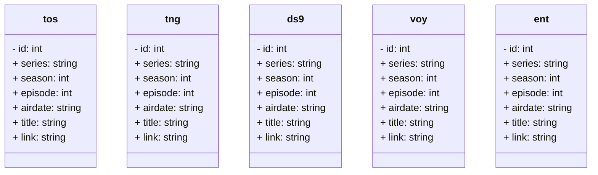

# Database structure
---

```mermaid
classDiagram
    class tos {
       - id: int
       + series: string
       + season: int
       + episode: int
       + airdate: string
       + title: string
       + link: string
    }

    class tng {
       - id: int
       + series: string
       + season: int
       + episode: int
       + airdate: string
       + title: string
       + link: string
    }

    class ds9 {
       - id: int
       + series: string
       + season: int
       + episode: int
       + airdate: string
       + title: string
       + link: string
    }

    class voy {
       - id: int
       + series: string
       + season: int
       + episode: int
       + airdate: string
       + title: string
       + link: string
    }

    class ent {
       - id: int
       + series: string
       + season: int
       + episode: int
       + airdate: string
       + title: string
       + link: string
    }
```