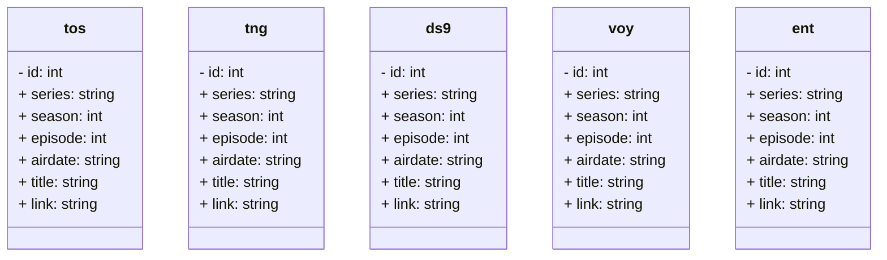

# Star Trek Episodes API

<!-- ### Project Context
Using all of the skills you’ve developed over the last two trimesters, you’re going to team up with a partner in creating your very own API from start to finish. You’ll develop a design, narrow down what should be in your MVP (minimum viable product), and work together as a team to bring your idea to life. You have a limited number of days to work on this project, so be sure to keep your scope reasonable for you and your team.

### Challenge
There is one rule that must be followed…your application must follow the theme, “Lost in Space?”. You and your team are free to interpret that in any way you see fit (keep it Safe For Work, though)! If you are interested in continuing where you left off on your Bob Ross API, feel free to use that as the starting point for this project and expand upon it with new features!

### Manual Review
When manually reviewing your peers, have them share with you (on their local computer) the API that they built. This will make reviewing easier than trying to set up their database and API on your local system. What this means when developing your API/database is to make sure that everything runs locally so that the manual review process is straightforward.

### Final Note
You are expected to have this project run locally on your machine (or sandbox environment), but you are welcome to find a way to host this online for your own purposes (especially if you wish to share this with others). If you choose to host this online, there is definitely a free/cheap way to do so, so be sure to look at the tools you are interested in using and verify their functionality as well as pricing model. Many tools online have a free tier that would be more than sufficient for this project.

* Database diagram can be found in [Design Documents/dbDesign.md](https://github.com/PStewart1/Lost-in-SPAAACE/blob/main/Design%20Documents/dbDesign.md)
* API documentation and instructions can be found in [Design Documents/API documentation.md](https://github.com/PStewart1/Lost-in-SPAAACE/blob/main/Design%20Documents/API%20documentation.md) -->

## Installation:
1. Clone Repo.
2. Install [Docker](https://docs.docker.com/engine/install/) and [Docker Compose](https://docs.docker.com/compose/install/) if you dont have them already.
3. Run `docker-compose up --build` to start docker images of the app and db.
4. Wait about 15 seconds till you see: 
   * `Container mysqlcontainer    Healthy`
   * `Container nodeappcontainer  Started`
in the terminal, so the containers can fully spin up and connect.

5. When finished, run `docker-compose down` to stop the containers, followed by `sudo rm -rfv ~/database/` to remove the database cache.
---

# API instructions

You can use Postman or your api tester of choice, on port 3000.

### Authentication
* First you must "login" by sending a POST request at `/login` with `"username": 'your name'` in the body.
* Copy the `"refreshToken"` to save in case you need to refresh your access token. The access token has an expiration of 15 minutes. Send it in a POST request to `/token` with `"token": ` followed by the refresh token, in the body.
* Copy the `"accessToken"` to use in your GET requests in the `Authorization:` header with the value `Bearer ` followed by the token.

### Pagination
You must include `page` and `limit` in the query parameters of all GET requests. "limit" dictates how many episodes you want listed at a time, and "page" indicates which page of results you're on.

### Endpoints
You can get all episodes with a GET at `/`, or filter them by title or date. You can search by show at `/search`, and filter by title, date, or season and episode, in the query parameters. 
* When searching by show at `/search`, you must include the show initials: `tos`, `tng`, `ds9`, `voy`, or `ent`. Use the key `show`.
* Date should be in this format `Jan 83`, with the key `stardate`. You must include month and year.
* When searching by `season`, you can search with or without an `episode` number, but you cannot search with an episode but no season.
* You can search by partial or complete `title`. If you enter more than one word, it will retrieve any titles that contain them in the order you entered.
---

# Database structure

